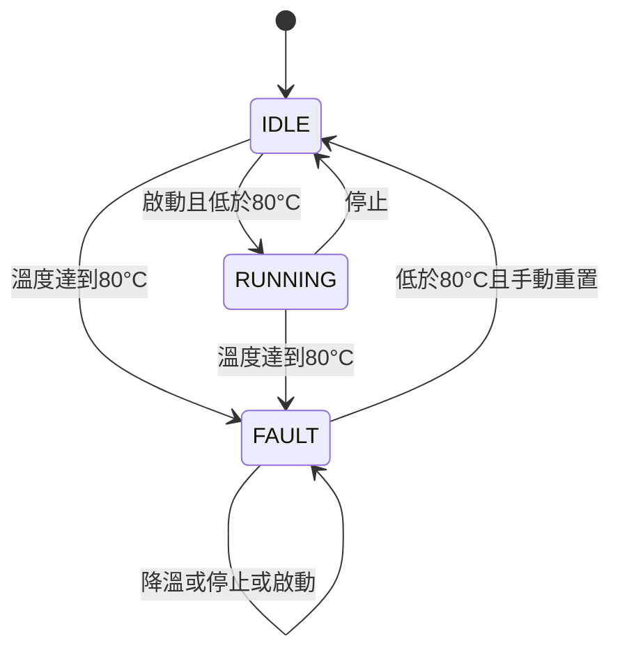

# 設計與控制規則

## 資料由主程式保存

`main.c` 保存 `state`、`temperature_c` 和事件序號。`controller.c` 接收資料並回傳新狀態，不讀鍵盤、不開啟檔案，也不保存全域設備狀態。因此控制規則能直接被單元測試呼叫。

```c
MachineState previous_state = state;
state = controller_update_temperature(state, temperature_c);
logger_write(log_file, sequence++, event, previous_state, state, temperature_c);
```

此流程先保存操作前狀態，再計算新狀態，最後記錄事件。呼叫者必須使用控制函式的回傳值，才能更新自己保存的狀態。

## 狀態轉移



模擬馬達僅在 `RUNNING` 時回傳 1。故障保持能避免「一降溫就立即啟動」；重置與啟動分成兩個操作。

| 函式 | 規則 |
|---|---|
| `controller_update_temperature` | 溫度達到門檻回傳 FAULT，否則保持狀態 |
| `controller_start` | 只處理 IDLE；過熱回傳 FAULT，正常回傳 RUNNING |
| `controller_stop` | RUNNING 變 IDLE，其他狀態保持 |
| `controller_reset` | FAULT 且低於門檻才變 IDLE |
| `controller_motor_is_on` | 狀態為 RUNNING 回傳 1，否則回傳 0 |

控制模組的介面預期收到合法 `MachineState`。主程式只使用已定義的狀態；紀錄模組另會拒絕無法轉換成名稱的狀態。

## 紀錄與錯誤處理

`logger_open()` 以 `a+b` 開啟檔案。空檔案建立標頭；既有檔案檢查標頭和最後的換行，不重新解讀歷史狀態。

`logger_write()` 先檢查參數，再用 `fprintf()` 寫入一列，最後用 `fflush()` 檢查送出緩衝資料的結果。事件名稱只接受英文大寫與底線，避免逗號和換行破壞欄位。

| 失敗位置 | 主程式行為 |
|---|---|
| 開檔或檔案格式檢查 | 回傳退出碼 1，不進入互動流程 |
| SESSION_START 寫入 | 回傳退出碼 1，設備維持初始待機 |
| 指令操作後寫入 | 停止模擬運轉、關閉檔案、回傳退出碼 1 |
| 最後事件寫入 | 設備已停止，回報錯誤並回傳退出碼 1 |
| 最後關檔 | 回報錯誤並回傳退出碼 1 |

操作先發生，紀錄才寫入；因此記錄失敗並不代表操作從未發生。這個專案採用失敗後停止的策略，沒有實作狀態變更與檔案寫入的原子交易。

## 測試設計

單元測試直接驗證控制函式與輸出列。整合測試啟動真正的 CLI 程序，輸入指令，檢查退出碼、CSV 完整事件順序，以及錯誤時的輸出。

`tests/logger_failure_stub.c` 在獨立測試執行檔中取代紀錄模組，使用 `MACHINEGUARD_TEST_FAIL_AT` 指定失敗序號。它驗證「主程式收到紀錄失敗時的反應」，沒有模擬實際硬碟滿載或實際 `fflush()` 失敗。
